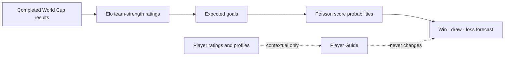

# Matchday — World Cup Intelligence

> A World Cup companion built for fans who love the game, the numbers, the uncertainty, and the chaos that makes football beautiful.

**Live Demo:**  
https://matchday-world-cup-intelligence.onrender.com

**GitHub Repository:**  
https://github.com/Bears-beets-battlestargalactica/matchday-world-cup-intelligence

> The public demo is hosted on Render’s free tier, so the first request may take a little while to wake up after inactivity.


---

## About the Project

**Matchday** is a data-aware World Cup intelligence app that brings together match forecasts, group standings, bracket scenarios, player snapshots, fan predictions, and an AI analyst into one interactive football experience.

I built this because I wanted something that felt more alive than a static prediction table.

Most football prediction projects stop at a percentage:

> Team A has a 54% chance.  
> Team B has a 23% chance.  
> Draw is 23%.

But football is never just a number.

A forecast should explain itself. A model should be honest about uncertainty. Fans should be able to disagree with it, make their own picks, explore possible routes to the final, and still enjoy the drama of the tournament. That is what Matchday tries to do.

This project became more than just a technical build for me. I worked through API limitations, deployment issues, provider caching, player data inconsistencies, model design choices, and public hosting problems to make the app feel usable, transparent, and real.

It is not perfect, but it is something I genuinely enjoyed building, breaking, fixing, and refining.

---

## What Matchday Does

- **Dashboard** — Shows upcoming fixtures, group context, model confidence, and the biggest decision edge.
- **Match Center** — Browse matches, compare any two teams, make fan picks, and open a match guide.
- **Group Scenarios** — Follow all 12 World Cup group tables.
- **Scenario Explorer** — Identify the strongest favourite and the most balanced upcoming match.
- **Tournament Challenge** — Pick remaining outcomes and a champion, then earn fan points as results arrive.
- **Bracketology Lab** — Build a possible route to the final from the current tournament picture.
- **AI Analyst** — Ask model-grounded questions like “Why is France favoured?” or “Who looks strongest so far?”
- **Player Guide** — Browse team squads, player photos, and available 2026 World Cup match-stat averages.
- **Public Leaderboard** — Register a nickname, make predictions, and compare your picks with other fans.

This is a fan project, not a betting product. There are no odds, no money mechanics, and no attempt to pretend that football can be solved by an algorithm.

---

## How the Prediction Model Works



The model uses a simple, explainable baseline:

1. **Elo ratings** estimate team strength from completed results.
2. The Elo gap is converted into expected goal values.
3. A **Poisson model** turns expected goals into possible scorelines and win/draw/loss probabilities.

The goal is not to create a black-box oracle. The goal is to make the forecast understandable.

Player data is intentionally kept separate from the prediction model. A player profile can add useful context, but individual player ratings are not secretly injected into the match forecast. That keeps the model honest and easier to reason about.

---

## Data Sources

| Data | Provider | How it is used |
| --- | --- | --- |
| Fixtures, results, and group data | football-data.org | Refreshes the World Cup schedule, completed results, and group context. |
| Squad snapshots and player photos | API-Football | Loads team rosters and player images on demand. |
| 2026 tournament player match stats | KickoffAPI | Displays available match-stat averages across completed 2026 World Cup appearances. |
| AI explanations | OpenRouter or OpenAI | Generates short, cautious, model-grounded analyst responses. |
| Public leaderboard | Supabase Postgres | Stores nicknames, predictions, and fan points. |
| Hosting | Render | Hosts the public FastAPI application. |

---

## A Note on Player Ratings

Player ratings are only shown when the provider has a recorded 2026 World Cup appearance for that player.

If a player has not played, or if match-stat data is unavailable, Matchday says so instead of inventing a rating or substituting historical data.

These ratings are **not global player rankings**. They are match-stat averages from available 2026 tournament appearances.

For the public Render deployment, KickoffAPI responses are cached so the Player Guide remains usable even when the live provider blocks or delays cloud-hosted requests. Cached player-stat data is used only for display and is never used inside the prediction model.

---

## Tech Stack

- **Backend:** FastAPI, Python
- **Frontend:** Vanilla HTML, CSS, JavaScript
- **Prediction Model:** Elo ratings + Poisson score probabilities
- **Database:** Supabase Postgres
- **AI Analyst:** OpenRouter or OpenAI
- **Football Data:** football-data.org, API-Football, KickoffAPI
- **Deployment:** Render

---

## Run Locally

### 1. Clone the Repository

```bash
git clone https://github.com/Bears-beets-battlestargalactica/matchday-world-cup-intelligence.git
cd matchday-world-cup-intelligence
```

### 2. Create a Virtual Environment and Install Dependencies

```bash
python3 -m venv .venv
.venv/bin/pip install -r backend/requirements.txt
```

### 3. Create Your Environment File

```bash
cp backend/.env.example .env
```

Add the provider keys you want to use:

```env
# Live fixtures and results
FOOTBALL_DATA_API_KEY=your_football_data_key

# Player photos and roster snapshots
API_FOOTBALL_KEY=your_api_football_key

# Current 2026 tournament player statistics and ratings
KICKOFF_API_KEY=your_kickoff_key

# AI analyst using OpenRouter
LLM_PROVIDER=openrouter
OPENROUTER_API_KEY=your_openrouter_key
OPENROUTER_MODEL=openrouter/free

# Persistent leaderboard
DATABASE_URL=your_supabase_postgres_connection_string
```

OpenAI is also supported if you prefer using it directly:

```env
OPENAI_API_KEY=your_openai_key
OPENAI_MODEL=your_openai_model
```

### 4. Start the App

```bash
.venv/bin/uvicorn backend.main:app --reload --port 8000
```

Open:

```text
http://127.0.0.1:8000
```

### 5. Refresh Fixture Data

```bash
curl -X POST http://127.0.0.1:8000/api/refresh
```

---

## Public API Endpoints

| Endpoint | Description |
| --- | --- |
| `GET /api/health` | Checks provider configuration and app health. |
| `GET /api/dashboard` | Dashboard data, standings, teams, and model metadata. |
| `GET /api/schedule` | Upcoming fixtures and forecasts. |
| `GET /api/groups` | World Cup group tables. |
| `GET /api/tournament` | Tournament outlook, fan scoring, and fixture context. |
| `POST /api/predict` | Forecast any two team names. |
| `POST /api/analyst` | Ask for a model-grounded explanation. |
| `GET /api/team-roster` | Load squad snapshots and player photos. |
| `GET /api/player-profile` | Load available 2026 player match-stat averages. |
| `POST /api/refresh` | Refresh official fixture and result data. |

Example prediction:

```bash
curl -X POST http://127.0.0.1:8000/api/predict \
  -H 'Content-Type: application/json' \
  -d '{"home":"Brazil","away":"France"}'
```

Check the public deployment:

```bash
curl https://matchday-world-cup-intelligence.onrender.com/api/health
```

Refresh public fixture data:

```bash
curl -X POST https://matchday-world-cup-intelligence.onrender.com/api/refresh
```

---

## Deploy on Render

This repository includes a `render.yaml` file for Render Blueprint deployment.

1. Push the repository to GitHub.
2. In Render, choose **New + → Blueprint**.
3. Select the GitHub repository.
4. Add the required secret environment variables in Render:

```text
FOOTBALL_DATA_API_KEY
API_FOOTBALL_KEY
KICKOFF_API_KEY
DATABASE_URL
OPENROUTER_API_KEY
```

The Blueprint already sets:

```text
LLM_PROVIDER=openrouter
OPENROUTER_MODEL=openrouter/free
```

After deployment, Render provides a public URL like:

```text
https://matchday-world-cup-intelligence.onrender.com
```

Check health:

```bash
curl https://matchday-world-cup-intelligence.onrender.com/api/health
```

Refresh fixtures:

```bash
curl -X POST https://matchday-world-cup-intelligence.onrender.com/api/refresh
```

Never commit `.env`. Provider keys belong only in your local `.env` file or in Render’s secret environment variables.

---

## What I Learned

This project pushed me through the full cycle of building something that actually works outside my laptop.

I had to work through:

- designing an explainable prediction model,
- combining multiple football data providers,
- handling incomplete and inconsistent player data,
- keeping model logic separate from contextual player information,
- adding an AI analyst without letting it invent unsupported claims,
- deploying a FastAPI app publicly,
- connecting Supabase for persistence,
- debugging Render environment variables,
- dealing with API provider limits and Cloudflare blocking,
- and adding cache fallbacks so the public demo still works reliably.

A lot of the work was not glamorous. Some of it was just reading logs, fixing deployment issues, adjusting environment variables, testing endpoints, and trying again.

But that is also what made the project feel real.

---

## Roadmap

Some improvements I would like to add next:

- Supabase Auth with email or magic-link sign-in.
- Friend leagues and private prediction groups.
- Automated scheduled fixture refreshes.
- More detailed bracket simulation logic.
- Shareable match cards and bracket images.
- Better player availability and injury context from verified sources.
- More visible explanation of how confidence and uncertainty are calculated.

---

## Built With

FastAPI · Python · Elo ratings · Poisson distributions · vanilla HTML/CSS/JavaScript · football-data.org · API-Football · KickoffAPI · OpenRouter · Supabase · Render

---

Made for fans who enjoy the numbers, respect the uncertainty, and still believe the 88th-minute equaliser is always possible.
