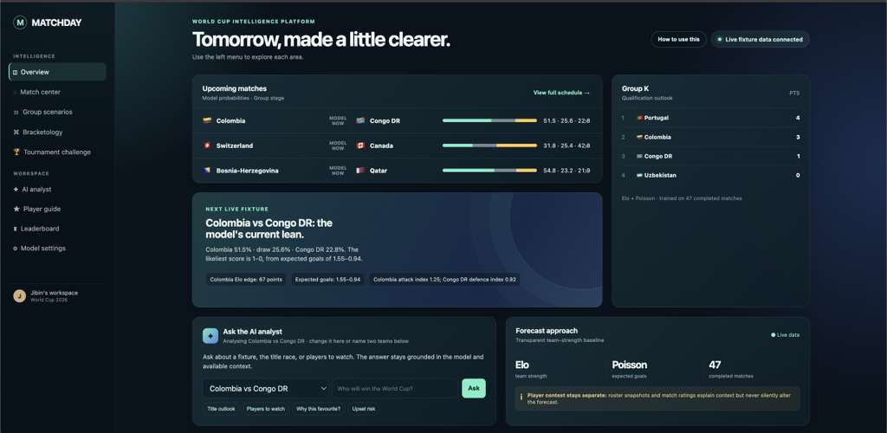
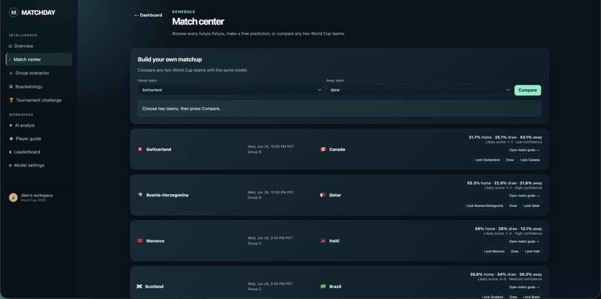
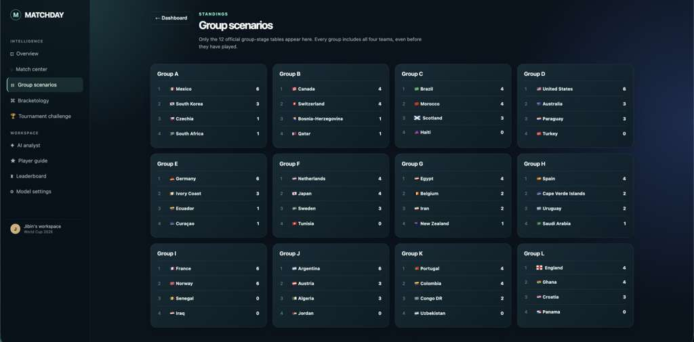
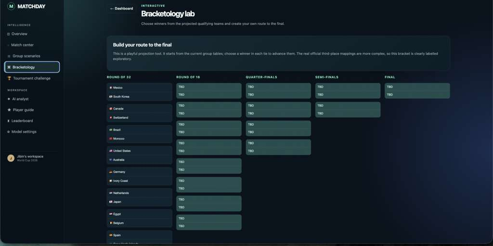
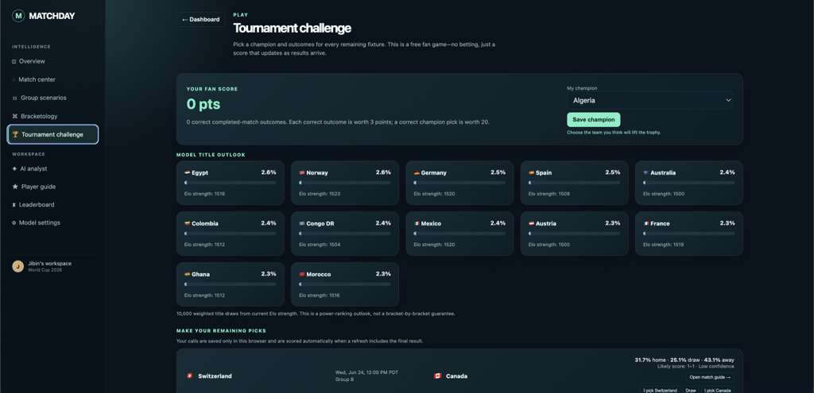
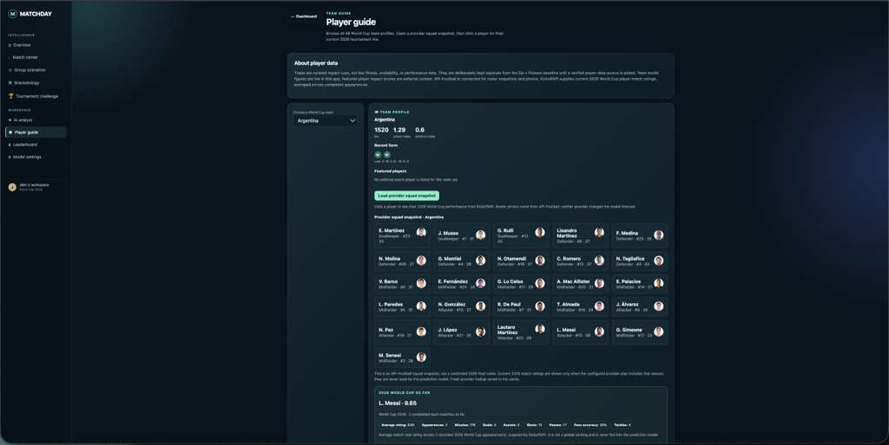
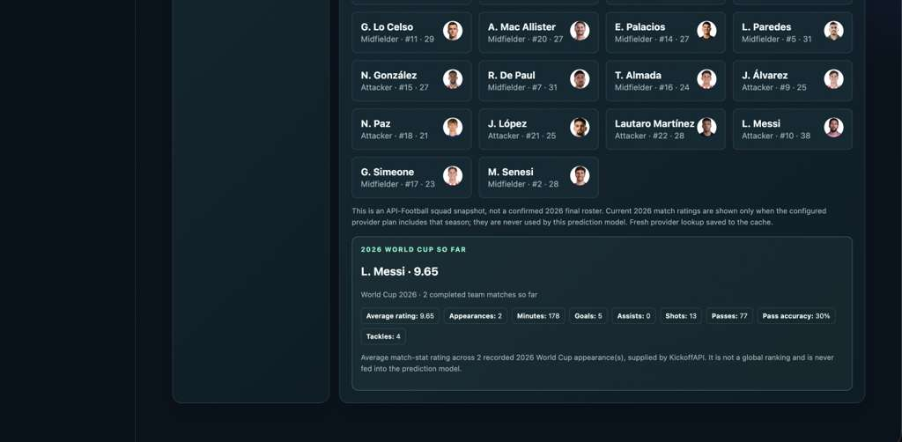
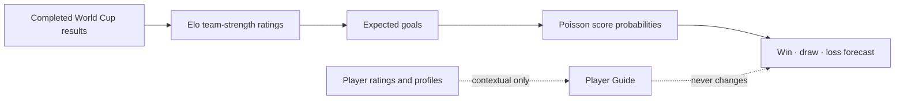

# Matchday — World Cup Intelligence

> A playful, data-aware World Cup companion: forecast matches, build a route to the final, inspect the groups, challenge your friends, and ask an AI analyst why the model leans one way.

**Live Demo:** [https://matchday-world-cup-intelligence.onrender.com](https://matchday-world-cup-intelligence.onrender.com)


> The public demo is hosted on Render’s free tier, so the first request may take a little while to wake up after inactivity.


---

## Preview

### Dashboard



### Match Center



### Group Scenarios



### Bracketology Lab



### Tournament Challenge



### Player Guide



### Player Rating Snapshot



---

## Why this exists

World Cup predictions are usually presented as a single magic percentage. Matchday takes a more useful approach: it shows the forecast, explains the uncertainty, lets fans make their own calls, and keeps player context separate from the prediction model.

This is a fan experience, not a betting product and not a claim that football can be solved by an algorithm. The model gives probabilities; the tournament supplies the chaos.

## What you can do

- **Dashboard** — See the next fixtures, live group context, model confidence, and the biggest decision edge.
- **Match center** — Browse scheduled matches, make free fan picks, compare any two World Cup teams, and open a match guide.
- **Group scenarios** — Follow all 12 group tables with every team present from the start.
- **Scenario explorer** — Find the strongest favourite and the most balanced upcoming match.
- **Tournament challenge** — Pick every remaining outcome and a champion. Earn fan points when results arrive; no money, no odds, no betting.
- **Bracketology lab** — Build a possible route to the final from the live group picture.
- **AI analyst** — Ask match-specific or tournament-wide questions, such as “Who is the title favourite?” or “Why is France favoured?”
- **Player guide** — Browse team profiles, load squad snapshots with photos, and inspect available **2026 World Cup** player match-stat averages.
- **Public leaderboard** — Register a nickname, make picks, and see how your calls compare with other fans.

## How the prediction model works



The model starts with team-level results:

1. **Elo ratings** represent relative team strength and update with completed results.
2. The Elo gap helps generate each team’s **expected goals**.
3. A **Poisson model** converts expected goals into plausible scorelines and home-win/draw/away-win probabilities.

Player data is deliberately separate. A brilliant player can enrich the conversation, but player ratings are never silently injected into the forecast. That keeps the baseline understandable and avoids pretending that a small collection of match ratings is a complete measure of a player.

## Data sources

| Data | Provider | How it is used |
| --- | --- | --- |
| Fixtures, results, group data | football-data.org | Refreshes the World Cup schedule and completed results. |
| Squad snapshots and player photos | API-Football | Loaded on demand in Player Guide and cached. |
| Current tournament player match stats | KickoffAPI | Averages available ratings and statistics across completed **2026 World Cup** appearances. |
| Natural-language explanations | OpenRouter or OpenAI | Turns the supplied model output into a short, cautious explanation. |
| Fan leaderboard | Supabase Postgres | Stores nicknames and prediction picks for the public leaderboard. |

### A note on player ratings

Player ratings are only shown when the provider has a recorded 2026 tournament appearance. If a player has not played, or a rating is unavailable, Matchday says so rather than substituting a historical World Cup rating. These are match-stat ratings, not global player rankings.

## Run locally

### 1. Clone and install

```bash
git clone https://github.com/Bears-beets-battlestargalactica/matchday-world-cup-intelligence.git
cd matchday-world-cup-intelligence

python3 -m venv .venv
.venv/bin/pip install -r backend/requirements.txt
```

### 2. Create your environment file

```bash
cp backend/.env.example .env
```

Add the providers you want to use:

```env
# Live fixtures and results
FOOTBALL_DATA_API_KEY=your_football_data_key

# Player photos and roster snapshots
API_FOOTBALL_KEY=your_api_football_key

# Current 2026 tournament player statistics and ratings
KICKOFF_API_KEY=your_kickoff_key

# AI analyst — OpenRouter example
LLM_PROVIDER=openrouter
OPENROUTER_API_KEY=your_openrouter_key
OPENROUTER_MODEL=openrouter/free

# Persistent leaderboard (Supabase Postgres)
DATABASE_URL=your_supabase_postgres_connection_string
```

`OPENAI_API_KEY` and `OPENAI_MODEL` are also supported if you prefer OpenAI directly instead of OpenRouter.

### 3. Start the app

```bash
.venv/bin/uvicorn backend.main:app --reload --port 8000
```

Open [http://127.0.0.1:8000](http://127.0.0.1:8000).

### 4. Refresh the fixture provider

With `FOOTBALL_DATA_API_KEY` configured:

```bash
curl -X POST http://127.0.0.1:8000/api/refresh
```

## Useful API endpoints

| Endpoint | Description |
| --- | --- |
| `GET /api/health` | Checks configured providers and application health. |
| `GET /api/dashboard` | Dashboard matches, standings, teams, and model metadata. |
| `GET /api/schedule` | Upcoming World Cup fixtures and forecasts. |
| `GET /api/groups` | The 12 group tables. |
| `GET /api/tournament` | Title outlook, fan-game scoring, and fixtures. |
| `POST /api/predict` | Forecast any two team names. |
| `POST /api/analyst` | Ask for a model-grounded explanation. |
| `GET /api/team-roster` | On-demand squad snapshot and player photos. |
| `GET /api/player-profile` | Current 2026 player aggregate, when available. |
| `POST /api/refresh` | Refresh official fixture and result data. |

Example prediction:

```bash
curl -X POST http://127.0.0.1:8000/api/predict \
  -H 'Content-Type: application/json' \
  -d '{"home":"Brazil","away":"France"}'
```

## Deploy on Render

The repository includes [render.yaml](render.yaml) for a Render Blueprint deployment.

1. Push this folder to GitHub, with `render.yaml` at the repository root.
2. In Render, choose **New + → Blueprint**, then select the GitHub repository.
3. Add your secret environment variables in Render’s **Environment** panel:

   ```text
   FOOTBALL_DATA_API_KEY
   API_FOOTBALL_KEY
   KICKOFF_API_KEY
   DATABASE_URL
   LLM_PROVIDER=openrouter
   OPENROUTER_API_KEY
   OPENROUTER_MODEL=openrouter/free
   ```

4. Deploy. Render will provide a public `onrender.com` URL.
5. Check `https://YOUR-RENDER-URL/api/health` and make sure the required providers report `configured: true`.

Never commit `.env`. It is ignored by Git on purpose. The public browser never receives the provider secrets.

More detail: [DEPLOY_RENDER.md](DEPLOY_RENDER.md).


## Roadmap ideas

- Email or magic-link accounts through Supabase Auth.
- User profiles, friend leagues, and private prediction groups.
- Automated periodic fixture refreshes.
- More transparent bracket simulation for official third-place qualification rules.
- Player availability and injury context from a verified provider, clearly separated from the baseline model.
- Shareable match cards and “my bracket” images.

## Built with

FastAPI · Python · Elo · Poisson distributions · vanilla HTML/CSS/JavaScript · football-data.org · API-Football · KickoffAPI · OpenRouter · Supabase · Render

---

Made for fans who enjoy the numbers, respect the uncertainty, and still believe the 88th-minute equaliser is always possible.
